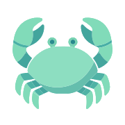

<!-- # 青蟹 Web -->

<div align="center">



# 青蟹 Web


</div>

你说得对，但是 “青蟹” 是四川轻化工大学开放原子开源协会设计并制作的协会管理系统，包括协会介绍、人员管理、公告/比赛管理等多种常用功能。

[公网地址](https://suseoaa.com) | [内网地址](https://fe.in.suseoaa.com)

> [!WARNING]
> 青蟹 Web 尚处于 v0.x 开发阶段，随时会产生 Breaking Changes，切勿直接部署到生产服务器。

“青蟹” 项目共分为 3 个部分，本仓库为其 Web 前端部分，基于 Vue 3 框架与 PrimeVue v4 组件库构建。关于其它部分，欢迎各位查阅：

- 后端：[suse-oaa-backend](https://github.com/suse-edu-cn/suse-oaa-backend)
- Android App：[suse-oaa-app](https://github.com/suse-edu-cn/suse-oaa-app)

## 主要功能及 Roadmap

- 首页介绍
- 协会用户系统
- 招新 / 换届申请、面试及管理
- 公告消息管理
- [TODO] 比赛发布及管理
- [TODO] 统一身份认证系统
- ......

## 食用方法
请先确定计算机已经安装 Node.js 环境 (版本 >= 24) 和 pnpm 包管理器 (版本 >= 9)，然后 clone 本项目并安装相关依赖。

```bash
git clone https://github.com/suse-edu-cn/oaa-frontend
pnpm install
```

接下来启动 dev server。本项目有 `development` 和 `development-public` 两个开发环境，默认使用前者，其会连接到实验室内网的后端服务，而后者连接公网后端。请根据实际情况选择启动命令。
```bash
pnpm dev        # 内网开发环境
pnpm dev:public # 公网开发环境
```

生产构建也有分内网与公网环境，默认为公网环境。
```bash
pnpm build:internal # 内网生产环境
pnpm build          # 公网生产环境
```

## 其它
本项目[图标](./public/oaa.svg)为 AI 生成，由 @HuangZhuoRui 与 @Neonsaya 提供，详情请见 commit [`c443197`](https://github.com/suse-edu-cn/oaa-frontend/commit/c443197f496f7dd05018ffc9057c63dc5e2c6000)。

(C) SUSE OAA Project Dept. Licensed under [GPL-3.0](./LICENSE).
